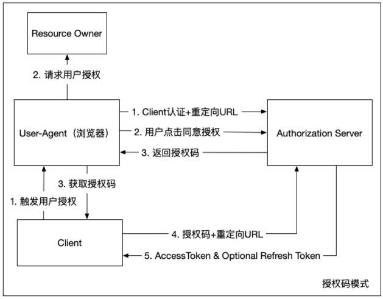
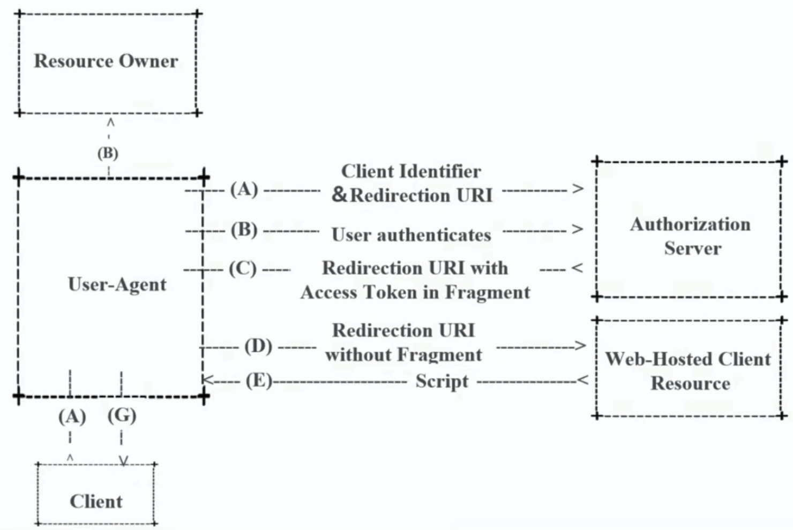
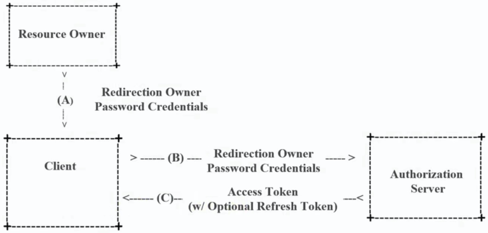

## 安全模块设计

> [OAuth2](http://terasolunaorg.github.io/guideline/5.3.0.RELEASE/en/Security/OAuth.html)

##### 角色

### OAuth2 Flow

##### 授权码模式：(Authorization code grant)

- 通过前端渠道客户获取授权码
- 通过后端渠道，客户使用授权码去交换access_token和可选的refresh_token
- 假定资源拥有者和客户在不同的设备上
- 最安全的流程，因为令牌不能传递经过user-agent（浏览器、原生App）

##### 简化模式：(Implicit grant)

- 适用于公开的浏览器单页应用
- access_token直接从授权服务器返回（只有前端渠道）
- 通常还会有一个脚本验证的环节
- 不支持refresh_token
- 假定资源所有者和公开的客户应用在同一设备上
- 最容易受安全攻击，有自有可用场景

##### 密码模式：(Resource owner password credential grant)

- 使用用户名密码的方式登录应用
- 使用用户名密码获取授权服务器的access_token
- 一般不支持refresh_token
- 假定资源拥有者和公开客户在同一设备上
- 有一定应用场景，比如资源和应用都是自家公司的

##### 客户端模式：(Client credential grant)

- 适用于服务器间通信的场景，机器客户代表它自己或者一个用户
- 只有后端渠道，使用客户凭证获取access_token
- 因为客户凭证可以使用对称或非对称加密，该方式支持共享密码或者证书

##### 选型

- 客户应用分类
  - 公开的（只存储客户标识，不存铭感信息）
    - 单页应用SPA（React、Angular、在浏览器跑的）
    - 原生App（IOS，Android）
  - 私密的（可存储客户凭证信息）
    - Web服务器端应用（Java、etc）
    - 服务/API（机器对机器）

##### 授权服务器：

- Authorize Endpoint（/oauth2/authorize）：授权端点
- Token Endpoint（/oauth2/token）：获取Token端点
- Introspection Endpoint（/oauth2/introspect）：校验Token端点
- Revocation Endpoint（/oauth2/revoke）：吊销Token端点

### JWT

##### 访问令牌类型：

- By Reference Token：透明令牌
  - 随机生成的字符串标识符，无法猜测，必须通过授权服务器检查端点，才能验证令牌是否有效
- By Value Token：自包含令牌
  - 包含用户或客户的元数据和声明信息：通过检查签名、期望的颁发者、期望接收人或scope，资源服务器可以在本地校验令牌，通常实现为签名的 JSON Web Tokens（JWT）

##### JWT:

三部分组成：base64url(Header) + base64url(Claims) + base64url(Signature)

https://jwt.lo 可以看到具体数据

- 定制 Claims 权限等
- JWT 对称 + 非对称 加密
- **使用JWE  对 JWT 令牌进行 加密/解密**